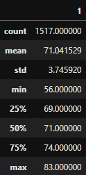
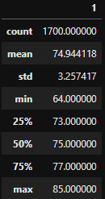

# Surfs Up

## Project Overview
The goal is to run a business analysis for surf/shake shop investment in Hawaii. Due to a similar previous failed investment caused by inclement weather, the client wants to ensure the temperature sustainable during the June and December months.

### Resources

## Results

- Mean Temperature
  - June: 74.9 vs. December 71.0
  - June 3.9 degrees warmer than December.
- Max Temperature
  - June: 85 vs. December: 83
  - June 2 degrees warmer max
- Min Temperature
  - June: 64 vs. December: 56
  - June 8 degrees warmer min

 December
 

June

## Summary

The temperature for the surf and shake shop is sustainable during June and December months. The standard deviation for both months (3.2 & 3.7) illustrate that there won't be a major temperature swings impacting the shop. There were over 3200 temperature readings for June and December months to give a complete set of data.

While temperature is key, the arguably more important metric would be percipitation. With the given data, determining the percipitation for the June and December months would help finalize the data to assist in making a decision. Months with a high percipitation would lead to a slow-down in bookings. 

Another query that could be could be used to determine shop placement would be the station. Merging the percipitation and/or temperature data with the different stations during the June and December months could give better insight of where the shop could go.

